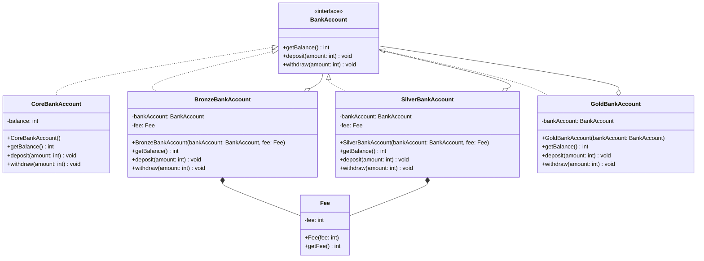

```mermaid
classDiagram
    class BankAccount {
        <<interface>>
        +getBalance() int
        +deposit(amount: int) void
        +withdraw(amount: int) void
    }

    class CoreBankAccount {
        -balance: int
        +CoreBankAccount()
        +getBalance() int
        +deposit(amount: int) void
        +withdraw(amount: int) void
    }

    class Fee {
        -fee: int
        +Fee(fee: int)
        +getFee() int
    }

    class BronzeBankAccount {
        -bankAccount: BankAccount
        -fee: Fee
        +BronzeBankAccount(bankAccount: BankAccount, fee: Fee)
        +getBalance() int
        +deposit(amount: int) void
        +withdraw(amount: int) void
    }

    class SilverBankAccount {
        -bankAccount: BankAccount
        -fee: Fee
        +SilverBankAccount(bankAccount: BankAccount, fee: Fee)
        +getBalance() int
        +deposit(amount: int) void
        +withdraw(amount: int) void
    }

    class GoldBankAccount {
        -bankAccount: BankAccount
        +GoldBankAccount(bankAccount: BankAccount)
        +getBalance() int
        +deposit(amount: int) void
        +withdraw(amount: int) void
    }

    BankAccount <|.. CoreBankAccount
    BankAccount <|.. BronzeBankAccount
    BankAccount <|.. SilverBankAccount
    BankAccount <|.. GoldBankAccount

    BronzeBankAccount o-- BankAccount
    SilverBankAccount o-- BankAccount
    GoldBankAccount o-- BankAccount

    BronzeBankAccount *-- Fee
    SilverBankAccount *-- Fee
```