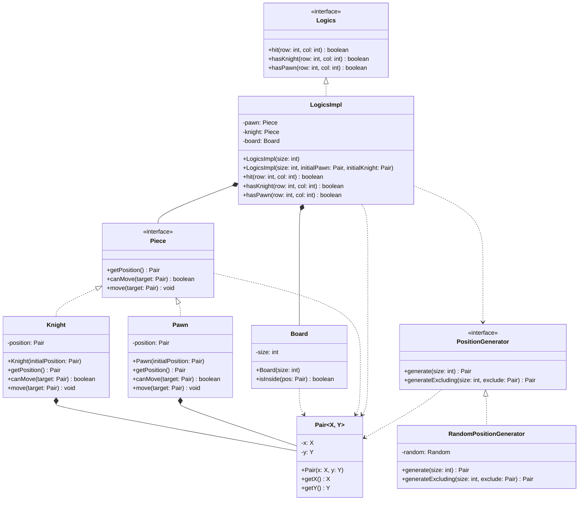

```mermaid
classDiagram
    class Logics {
        <<interface>>
        +hit(row: int, col: int) boolean
        +hasKnight(row: int, col: int) boolean
        +hasPawn(row: int, col: int) boolean
    }

    class LogicsImpl {
        -pawn: Piece
        -knight: Piece
        -board: Board
        +LogicsImpl(size: int)
        +LogicsImpl(size: int, initialPawn: Pair, initialKnight: Pair)
        +hit(row: int, col: int) boolean
        +hasKnight(row: int, col: int) boolean
        +hasPawn(row: int, col: int) boolean
    }

    class Piece {
        <<interface>>
        +getPosition() Pair
        +canMove(target: Pair) boolean
        +move(target: Pair) void
    }

    class Knight {
        -position: Pair
        +Knight(initialPosition: Pair)
        +getPosition() Pair
        +canMove(target: Pair) boolean
        +move(target: Pair) void
    }

    class Pawn {
        -position: Pair
        +Pawn(initialPosition: Pair)
        +getPosition() Pair
        +canMove(target: Pair) boolean
        +move(target: Pair) void
    }

    class PositionGenerator {
        <<interface>>
        +generate(size: int) Pair
        +generateExcluding(size: int, exclude: Pair) Pair
    }

    class RandomPositionGenerator {
        -random: Random
        +generate(size: int) Pair
        +generateExcluding(size: int, exclude: Pair) Pair
    }

    class Board {
        -size: int
        +Board(size: int)
        +isInside(pos: Pair) boolean
    }

    class Pair~X, Y~ {
        -x: X
        -y: Y
        +Pair(x: X, y: Y)
        +getX() X
        +getY() Y
    }

    Logics <|.. LogicsImpl
    Piece <|.. Knight
    Piece <|.. Pawn
    PositionGenerator <|.. RandomPositionGenerator
    LogicsImpl *-- Piece
    LogicsImpl *-- Board
    LogicsImpl ..> PositionGenerator
    Knight *-- Pair
    Pawn *-- Pair
    Board ..> Pair
    Piece ..> Pair
    LogicsImpl ..> Pair
    PositionGenerator ..> Pair
```