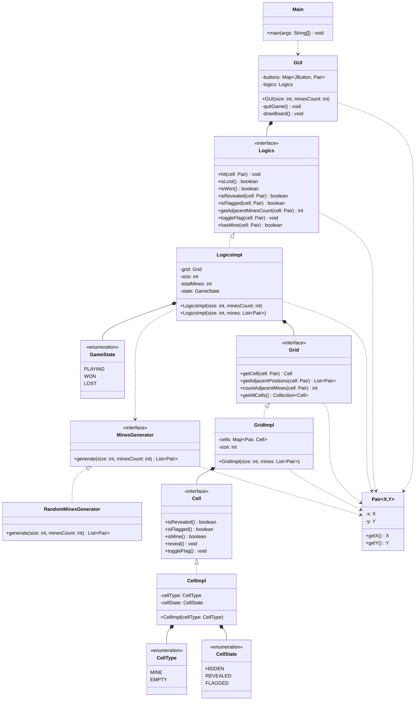

```mermaid
classDiagram
    class Main {
    +main(args: String[]) void
    }

    class GUI {
        -buttons: Map~JButton, Pair~
        -logics: Logics
        +GUI(size: int, minesCount: int)
        -quitGame() void
        -drawBoard() void
    }

    class Logics {
        <<interface>>
        +hit(cell: Pair) void
        +isLost() boolean
        +isWon() boolean
        +isRevealed(cell: Pair) boolean
        +isFlagged(cell: Pair) boolean
        +getAdjacentMinesCount(cell: Pair) int
        +toggleFlag(cell: Pair) void
        +hasMine(cell: Pair) boolean
    }

    class LogicsImpl {
        -grid: Grid
        -size: int
        -totalMines: int
        -state: GameState
        +LogicsImpl(size: int, minesCount: int)
        +LogicsImpl(size: int, mines: List~Pair~)
    }

    class GameState {
        <<enumeration>>
        PLAYING
        WON
        LOST
    }

    class MinesGenerator {
        <<interface>>
        +generate(size: int, minesCount: int) List~Pair~
    }

    class RandomMinesGenerator {
        +generate(size: int, minesCount: int) List~Pair~
    }

    class Grid {
        <<interface>>
        +getCell(cell: Pair) Cell
        +getAdjacentPositions(cell: Pair) List~Pair~
        +countAdjacentMines(cell: Pair) int
        +getAllCells() Collection~Cell~
    }

    class GridImpl {
        -cells: Map~Pair, Cell~
        -size: int
        +GridImpl(size: int, mines: List~Pair~)
    }

    class Cell {
        <<interface>>
        +isRevealed() boolean
        +isFlagged() boolean
        +isMine() boolean
        +reveal() void
        +toggleFlag() void
    }

    class CellImpl {
        -cellType: CellType
        -cellState: CellState
        +CellImpl(cellType: CellType)
    }

    class CellType {
        <<enumeration>>
        MINE
        EMPTY
    }

    class CellState {
        <<enumeration>>
        HIDDEN
        REVEALED
        FLAGGED
    }

    class Pair~X,Y~ {
        -x: X
        -y: Y
        +getX() X
        +getY() Y
    }

    Main ..> GUI
    GUI *-- Logics
    
    Logics <|.. LogicsImpl
    Grid <|.. GridImpl
    Cell <|.. CellImpl
    MinesGenerator <|.. RandomMinesGenerator
    
    LogicsImpl *-- Grid
    LogicsImpl *-- GameState
    LogicsImpl ..> MinesGenerator
    GridImpl *-- Cell
    
    CellImpl *-- CellType
    CellImpl *-- CellState
    
    GUI ..> Pair
    Logics ..> Pair
    LogicsImpl ..> Pair
    Grid ..> Pair
    GridImpl ..> Pair
    MinesGenerator ..> Pair
```